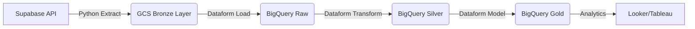

# 🐾 Salvando Patitas Data Platform (SPDP)

> **Ingeniería de Datos aplicada al Bienestar Animal.**  
> *Una plataforma moderna, escalable y automatizada para optimizar la gestión de rescates, donaciones y recursos.*

---

## 📖 Sobre el Proyecto: Full-Stack Data Engineering

**Salvando Patitas** es una fundación dedicada al rescate y rehabilitación de animales. Este proyecto no es solo una plataforma de datos; es una **solución integral (End-to-End)** diseñada, construida y operada por un solo ingeniero con visión de negocio.

### 🌟 Diferenciadores Clave
1.  **Visión Full-Stack & Autoria Total:** 
    *   No solo ingestamos datos; **construimos la fuente**. El sistema operativo de la fundación (CRM) fue desarrollado a medida utilizando **Django y React**.
    *   Esto garantiza un conocimiento profundo del dato desde su creación por el usuario final hasta su explotación en los dashboards de BI, eliminando las cajas negras.
2.  **Eficiencia de Costos Radical (Cloud FinOps):**
    *   Arquitectura optimizada para operar con **menos de $0.01 USD diarios**.
    *   Uso estratégico de Cloud Run Jobs (Serverless) y BigQuery On-Demand para maximizar el ROI de una organización sin fines de lucro.
    *   *Pensamiento de Ingeniero Industrial aplicado a la Nube: Máximo valor, mínimo desperdicio.*

Este repositorio contiene la implementación del **Data Lakehouse** que alimenta la inteligencia de negocio de la fundación, respondiendo preguntas críticas sobre eficiencia operativa y sostenibilidad financiera.

---

## 🛠️ Tech Stack & Habilidades

Este proyecto demuestra competencias en el **Modern Data Stack**:

*   **Lenguajes:** 🐍 Python (ETL), 📜 SQLX (Dataform), 🐚 Bash.
*   **Cloud (GCP):** ☁️ Google Cloud Storage (Data Lake), 🔍 BigQuery (Data Warehouse).
*   **Orquestación & Transformación:** 🏗️ Google Dataform (CI/CD para SQL), Modular Python Scripts.
*   **Fuentes de Datos:** ⚡ Supabase (PostgreSQL).
*   **Buenas Prácticas:**
    *   Arquitectura **Medallion** (Bronze 🥉 -> Silver 🥈 -> Gold 🥇).
    *   **Data Quality Testing** (Assertions automáticos).
    *   Estrategias de carga **Incremental** y **Snapshot**.
    *   Infraestructura como Código (IaC).

---

## 🏗️ Arquitectura de la Solución

El flujo de datos está diseñado para ser robusto, idempotente y fácil de mantener:



### Componentes Clave

| Componente | Descripción | Herramienta |
| :--- | :--- | :--- |
| **Ingesta (ETL)** | Scripts modulares en Python con paginación, manejo de tipos estrictos y control de watermarks. | `src/etl/` |
| **Data Lake** | Almacenamiento costo-eficiente en parquets particionados y snapshots. | GCS |
| **Transformación** | Pipeline ELT con gestión de dependencias, grafos de ejecución y testing. | Dataform |
| **Calidad** | Reglas de negocio (Assertions) para validar unicidad, integridad referencial y nulos. | SQLX |

---

## 📂 Estructura del Repositorio

```text
/
├── src/                 # 🐍 Lógica de Extracción (Python Modular)
│   ├── etl/             # Config, Connect, Extract, Transform, Load
│   └── main.py          # Orquestador del pipeline
├── dataform/            # 🏗️ Lógica de Transformación (SQLX)
│   ├── definitions/     # Modelos (Raw, Silver, Gold, Assertions)
│   └── workflow.yaml    # Configuración del pipeline
├── scripts/             # 🛠️ Herramientas de Mantenimiento (Backfill, Cleaning)
├── docs/                # 📚 Documentación Técnica Detallada
└── .github/             # 🤖 CI/CD Pipelines (Integración con GCP)
```

## 📚 Documentación Detallada

Si deseas profundizar en los aspectos técnicos, consulta:

*   **[🏗️ Arquitectura y Estrategias de Carga](docs/ARCHITECTURE.md)** (Incremental vs Full Load).
*   **[🛠️ Manual de Operaciones y Mantenimiento](docs/MAINTENANCE.md)**.
*   **[🚑 Log de Resolución de Problemas](docs/TROUBLESHOOTING.md)**.

---

## 🚀 Cómo Ejecutar (Local)

1.  **Clonar y configurar entorno:**
    ```bash
    git clone https://github.com/vladmarinovich/Data-platform-fsp-portafolio.git
    cd Data-platform-fsp-portafolio
    python3 -m venv .venv
    source .venv/bin/activate
    pip install -r requirements.txt
    ```

2.  **Correr Pipeline de Ingesta:**
    ```bash
    python3 -m src.main
    ```


---

## 🚀 Automatización y Despliegue (ETL Pipeline)

El proceso de ingesta ha sido contenerizado y automatizado para ejecutarse diariamente de forma desasistida ("Serverless").

### 🏗️ Arquitectura de Despliegue
1.  **Docker:** Empaquetamos la lógica Python (`src/`) y sus dependencias en una imagen ligera (`python:3.12-slim`).
2.  **Artifact Registry:** Repositorio privado en GCP donde se almacenan las versiones de la imagen.
3.  **Cloud Run Jobs:** Ejecuta el contenedor bajo demanda. Ideal para tareas batch que tienen un inicio y un fin.
4.  **Cloud Scheduler:** "El Despertador". Activa el Job de Cloud Run todos los días a las **07:00 AM**.

### 🔄 CI/CD Manual (Deployment)
Para actualizar el código de producción, utilizamos **Google Cloud Build** para construir la imagen en la nube sin dependencias locales:

```bash
# 1. Construir y Subir Imagen (Build & Push)
gcloud builds submit --tag us-central1-docker.pkg.dev/fsp-pipeline-project/spdp-repo/etl-runner:latest .

# 2. El Cloud Run Job detectará automáticamente la etiqueta 'latest' en la próxima ejecución.
# (Opcional) Para forzar una ejecución manual inmediata:
gcloud run jobs execute etl-runner-job --region southamerica-west1
```

---

Diseñado y desarrollado por **Vladislav Marinovich**.  
*Transformando datos en segundas oportunidades.* �
