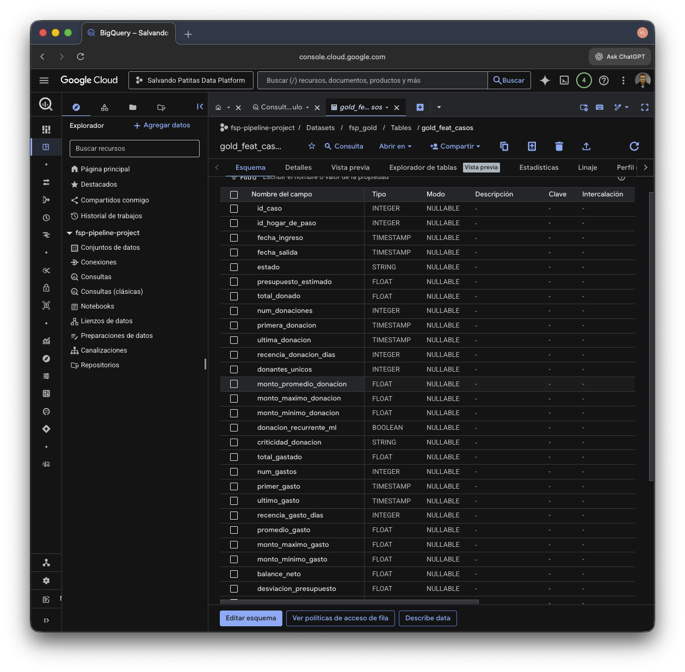
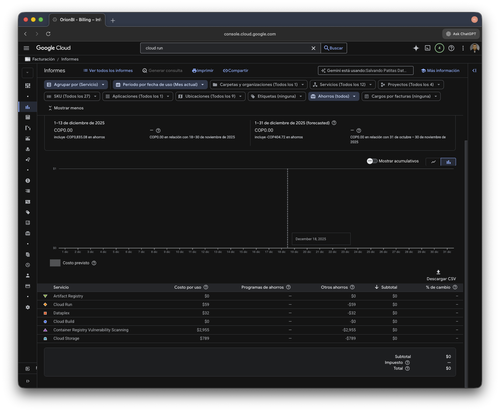

# 🐾 Salvando Patitas Data Platform

[](https://notion.so/tu-enlace-aqui)
[](https://miro.com/welcomeonboard/UkduTDRzZFZlSW9xek1EL2dwRG1XVG8rQmRvcVFWbGhRMEhjVHBmUnU5MSs0ek5LdlZxSHcyOE15UXNydlNkOHQ1N3ROTEdEd2dQOVhEcDN4MlF6S0d0WEJySWE5c2xhNGNnVHB1WXRGNGl2OWJZNlhydU00bWVoOFRZK095bkNhWWluRVAxeXRuUUgwWDl3Mk1qRGVRPT0hdjE=?share_link_id=538214555000)
[](https://console.cloud.google.com/cloud-build)

> 🚀 **Modern Data Platform** serverless y escalable para la fundación *Salvando Patitas*. Centraliza, limpia y transforma datos operativos dispersos en insights de alto valor.

---

## 🏗️ Arquitectura de Alto Nivel

El sistema implementa un **Lakehouse Serverless** en BigQuery, desacoplando ingesta (Python/Cloud Run) de transformación (Dataform), orquestado automáticamente para procesamiento diario.


---

## 📚 Mapa de Documentación

Toda la documentación técnica detallada vive dentro del repositorio y en Notion. Usa esta guía para navegar:

| ¿Qué buscas? | 📄 Archivo Local | 🔗 Enlace Notion (Profundo) |
| :--- | :--- | :--- |
| **Diseño y Modelo de Datos** | [`docs/ARCHITECTURE.md`](docs/ARCHITECTURE.md) | [Ver Capas Bronze/Silver/Gold](https://notion.so/tu-enlace-a-arquitectura) |
| **Manual de Operaciones** | [`docs/MAINTENANCE.md`](docs/MAINTENANCE.md) | [Ver Runbook & Comandos](https://notion.so/tu-enlace-a-runbook) |
| **Solución de Errores** | [`docs/TROUBLESHOOTING.md`](docs/TROUBLESHOOTING.md) | [Ver Log de Problemas](https://notion.so/tu-enlace-a-troubleshooting) |
| **Galería de Evidencia** | *Ver abajo* 👇 | [Ver Screenshots Reales](https://notion.so/tu-enlace-a-galeria) |

---

## ⚡ Quick Start

Para levantar el entorno de desarrollo localmente:

1.  **Requisitos**: Python 3.12+, Docker, Google Cloud SDK.
2.  **Configuración**:
    ```bash
    make setup      # Instala dependencias y prepara .env
    ```
3.  **Ejecución Local (ETL)**:
    ```bash
    make run        # Ejecuta el pipeline completo en Docker local
    ```
4.  **Despliegue a Producción**:
    ```bash
    make deploy     # (Manual) Sube a Cloud Run. CI/CD lo hace automático al push.
    ```

> *Para ver todos los comandos disponibles y cómo resetear datos, consulta [`docs/MAINTENANCE.md`](docs/MAINTENANCE.md).*

---

## 🧪 Estado del Proyecto

| Componente | Estado | Tecnología |
| :--- | :---: | :--- |
| **Ingesta** | ✅ Activo | Python, Pandas, Cloud Run Jobs |
| **Data Lake** | ✅ Activo | Google Cloud Storage (Parquet) |
| **Warehouse** | ✅ Activo | BigQuery (External Tables) |
| **Transformación** | ✅ Activo | Dataform (SQLX), Medallion Architecture |
| **Orquestación** | ✅ Activo | Cloud Scheduler, Watermarks State |
| **CI/CD** | ✅ Activo | Cloud Build, Artifact Registry |

---

## 📸 Galería de Operación

Evidencia real de la plataforma en funcionamiento productivo:

| CI/CD Automatizado (Cloud Build) | Ejecución Serverless (Cloud Run) |
|:--------------------------------:|:--------------------------------:|
|  |  |

| Linaje de Datos (Dataform DAG) | Modelado Dimensional (BigQuery) |
|:------------------------------:|:-------------------------------:|
|  |  |

<details>
<summary>👀 <strong>Ver más capturas (Costos, Ejecución)</strong></summary>

### Dataform en Acción


### Eficiencia de Costos
> Costo operativo optimizado (Nivel gratuito GCP).


</details>

---
Hecho con 💜 por Vladislav Marinovich.
