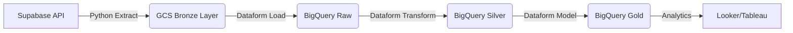

# 🐾 Salvando Patitas Data Platform (SPDP)

> **Ingeniería de Datos aplicada al Bienestar Animal.**  
> *Una plataforma moderna, escalable y automatizada para optimizar la gestión de rescates, donaciones y recursos.*

---

## 📖 Sobre el Proyecto

**Salvando Patitas** es una fundación dedicada al rescate y rehabilitación de animales. Este proyecto nace de la necesidad de centralizar y procesar sus datos operativos para responder preguntas críticas:
*   ¿Cuál es la eficiencia de los hogares de paso?
*   ¿Cómo optimizar el presupuesto mensual de donaciones?
*   ¿Qué proveedores veterinarios son críticos para la operación?

Este repositorio contiene la implementación completa de una **Plataforma de Datos (Lakehouse)** que ingesta, limpia y modela información financiera y operativa para la toma de decisiones basada en datos.

---

## 🛠️ Tech Stack & Habilidades

Este proyecto demuestra competencias en el **Modern Data Stack**:

*   **Lenguajes:** 🐍 Python (ETL), 📜 SQLX (Dataform), 🐚 Bash.
*   **Cloud (GCP):** ☁️ Google Cloud Storage (Data Lake), 🔍 BigQuery (Data Warehouse).
*   **Orquestación & Transformación:** 🏗️ Google Dataform (CI/CD para SQL), Modular Python Scripts.
*   **Fuentes de Datos:** ⚡ Supabase (PostgreSQL).
*   **Buenas Prácticas:**
    *   Arquitectura **Medallion** (Bronze 🥉 -> Silver 🥈 -> Gold 🥇).
    *   **Data Quality Testing** (Assertions automáticos).
    *   Estrategias de carga **Incremental** y **Snapshot**.
    *   Infraestructura como Código (IaC).

---

## 🏗️ Arquitectura de la Solución

El flujo de datos está diseñado para ser robusto, idempotente y fácil de mantener:



### Componentes Clave

| Componente | Descripción | Herramienta |
| :--- | :--- | :--- |
| **Ingesta (ETL)** | Scripts modulares en Python con paginación, manejo de tipos estrictos y control de watermarks. | `src/etl/` |
| **Data Lake** | Almacenamiento costo-eficiente en parquets particionados y snapshots. | GCS |
| **Transformación** | Pipeline ELT con gestión de dependencias, grafos de ejecución y testing. | Dataform |
| **Calidad** | Reglas de negocio (Assertions) para validar unicidad, integridad referencial y nulos. | SQLX |

---

## 📂 Estructura del Repositorio

```text
/
├── src/                 # 🐍 Lógica de Extracción (Python Modular)
│   ├── etl/             # Config, Connect, Extract, Transform, Load
│   └── main.py          # Orquestador del pipeline
├── dataform/            # 🏗️ Lógica de Transformación (SQLX)
│   ├── definitions/     # Modelos (Raw, Silver, Gold, Assertions)
│   └── workflow.yaml    # Configuración del pipeline
├── scripts/             # 🛠️ Herramientas de Mantenimiento (Backfill, Cleaning)
├── docs/                # 📚 Documentación Técnica Detallada
└── .github/             # 🤖 CI/CD Pipelines (Integración con GCP)
```

## 📚 Documentación Detallada

Si deseas profundizar en los aspectos técnicos, consulta:

*   **[🏗️ Arquitectura y Estrategias de Carga](docs/ARCHITECTURE.md)** (Incremental vs Full Load).
*   **[🛠️ Manual de Operaciones y Mantenimiento](docs/MAINTENANCE.md)**.
*   **[🚑 Log de Resolución de Problemas](docs/TROUBLESHOOTING.md)**.

---

## 🚀 Cómo Ejecutar (Local)

1.  **Clonar y configurar entorno:**
    ```bash
    git clone https://github.com/vladmarinovich/Data-platform-fsp-portafolio.git
    cd Data-platform-fsp-portafolio
    python3 -m venv .venv
    source .venv/bin/activate
    pip install -r requirements.txt
    ```

2.  **Correr Pipeline de Ingesta:**
    ```bash
    python3 -m src.main
    ```

---
Diseñado y desarrollado por **Vladislav Marinovich**.  
*Transformando datos en segundas oportunidades.* �
