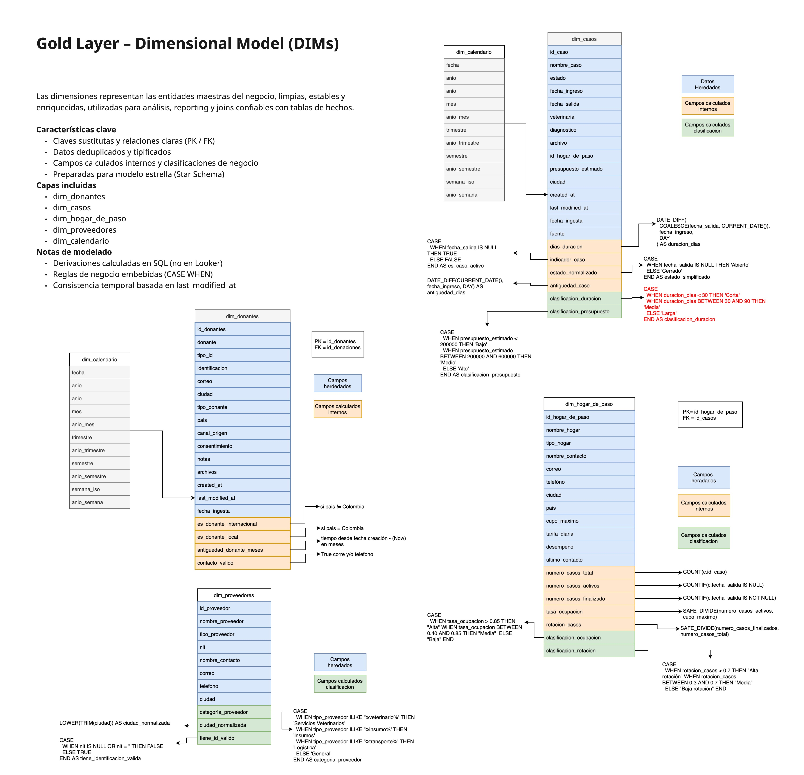

# 🏗️ Arquitectura de Datos: SPDP (Salvando Patitas Data Platform)

Este documento describe la arquitectura técnica de nuestra plataforma, diseñada bajo el paradigma **Lakehouse**. La solución integra un robusto ingestion pipeline en Python con un potente motor de transformación en Dataform (Google Cloud).

---

## 🏛️ Diseño Conceptual: Medallion Architecture

Hemos implementado una arquitectura de tres capas ("Medallion") para garantizar la calidad y gobernanza de los datos en cada etapa del proceso.

### 🥉 Bronze Layer (Raw)
*   **Fuente:** API transaccional de Supabase.
*   **Formato:** Archivos Parquet nativos con tipado estricto.
*   **Estrategia:** Ingesta incremental diaria (basada en `last_modified_at`) + Snapshots totales para catálogos maestros.
*   **Objetivo:** Ser la "fuente de la verdad" inmutable. Si algo falla aguas abajo, siempre podemos reconstruir desde aquí.

### 🥈 Silver Layer (Clean & Trusted)
*   **Herramienta:** Dataform (SQLX).
*   **Transformaciones:**
    *   **Deduplicación:** Uso de `ROW_NUMBER() OVER(PARTITION BY id ORDER BY last_modified_at DESC)` para obtener la última versión de cada registro.
    *   **Limpieza de Tipos:** Casteo seguro (`SAFE_CAST`) de strings a timestamps/numerics, tratamiento de nulos (`COALESCE`).
    *   **Integridad:** Validaciones básicas de claves foráneas.
*   **Objetivo:** Tener datos limpios y listos para consultar, eliminando basura técnica.
    
    

### 🥇 Gold Layer (Business Ready)
*   **Modelo:** Esquema Estrella (Star Schema) modificado.
    
    *Modelo Dimensional (Dimensions):*
    
    
    *Modelo de Hechos (Facts):*
    
    *   **Dimensions (DIM):** `dim_casos`, `dim_donantes`, `dim_proveedores`, `dim_hogar`. Tablas desnormalizadas con atributos descriptivos.
    *   **Facts (FACT):** `facts_donaciones`, `facts_gastos`. Tablas transaccionales enriquecidas con claves sustitutas.
    *   **Features (FEAT):** `feat_donaciones`, `feat_gastos`. Ingeniería de características específica para alimentar modelos de Machine Learning (aggregations, rolling windows, RFM scoring).
    
    

---

## 🔄 Pipeline de Extracción (Python)

El corazón de la ingesta es un script modular optimizado para latencia y costo.

### 1. Tablas Transaccionales (Estrategia Incremental)
*   **Scope:** `casos`, `donaciones`, `gastos`, `donantes`.
*   **Lógica:** Consulta solo registros donde `updated_at > watermark_anterior`.
*   **Persistencia:** Particionamiento Hive (`y=YYYY/m=MM/d=DD`) en GCS para optimizar costos de query en BigQuery.

### 2. Tablas Maestras (Estrategia Snapshot)
*   **Scope:** `proveedores`, `hogar_de_paso`.
*   **Lógica:** Descarga completa (`Full Refresh`) en cada ejecución.
*   **Persistencia:** Sobrescritura en ruta `latest/` para garantizar unicidad sin lógica compleja de deduplicación.

### 🚀 CI/CD & Despliegue
Flujo automatizado de construcción y publicación del artefacto Docker:

---

## 🧪 Calidad de Datos (Data Quality Assurance)

No confiamos ciegamente en los datos. Hemos implementado un framework de pruebas automatizadas con **Dataform Assertions**:

1.  **Unicidad:** `assert_unique_key` valida que no existan IDs duplicados en capa Silver.
2.  **Referencialidad:** Validamos que cada `id_donante` en donaciones exista en la tabla de `donantes`.
3.  **Reglas de Negocio:**
    *   Montos de donación no pueden ser negativos.
    *   Fechas de pago no pueden ser futuras (a más de 1 día) ni anteriores a 2010.

Si una aserción falla, el pipeline alerta al equipo, pero (configurado actualmente) no detiene el flujo crítico, permitiendo análisis post-mortem.

---
**Arquitecto:** Vladislav Marinovich  
**Stack:** GCP (BigQuery, GCS, Dataform), Python, Supabase.
